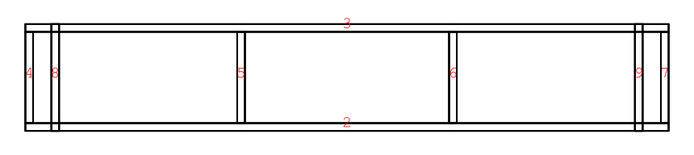
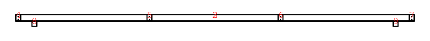

# Insulation boards

* [Full model](full_model.stl)

* [Structure](structure.stl)

## Projected Views

### View from above

### Side view

## Components

| Index | Memberships |
|-|-|
| 0 | covers |
| 1 | covers |
| 2 | main_support, structure |
| 3 | main_support, structure |
| 4 | connecting_beams, structure |
| 5 | connecting_beams, structure |
| 6 | connecting_beams, structure |
| 7 | connecting_beams, structure |
| 8 | alignment, structure |
| 9 | alignment, structure |

## Square beam

Diagrams for nodes with these dimensions.

### Layout 1/1

| Beam | Label | X | Y | Length | Comment |
|-|-|-|-|-|-|
| 8 | c | 0.010 | 0.000 |  |  |
| 8 | d | 0.010 | 0.030 |  |  |
| 8 | b | 0.425 | 0.000 |  |  |
| 8 | a | 0.425 | 0.030 |  |  |
| 8 | Overall height |  |  | 0.030 |  |
| 8 | Overall length |  |  | 0.415 |  |
| 9 | g | 0.435 | 0.000 |  |  |
| 9 | h | 0.435 | 0.030 |  |  |
| 9 | f | 0.849 | 0.000 |  |  |
| 9 | e | 0.849 | 0.030 |  |  |
| 9 | Overall height |  |  | 0.030 |  |
| 9 | Overall length |  |  | 0.415 |  |

| Index | Memberships |
|-|-|
| 8 | alignment, structure |
| 9 | alignment, structure |

## Strong beam

Diagrams for nodes with these dimensions.

### Layout 1/3

| Beam | Label | X | Y | Length | Comment |
|-|-|-|-|-|-|
| 2 | d | 0.010 | 0.000 |  |  |
| 2 | a | 0.010 | 0.040 |  |  |
| 2 | B | 0.025 | 0.012 |  | Common drill, radius = 0.003 |
| 2 | A | 0.025 | 0.028 |  | Common drill, radius = 0.003 |
| 2 | D | 0.848 | 0.012 |  | Common drill, radius = 0.003 |
| 2 | C | 0.848 | 0.028 |  | Common drill, radius = 0.003 |
| 2 | F | 1.672 | 0.012 |  | Common drill, radius = 0.003 |
| 2 | E | 1.672 | 0.028 |  | Common drill, radius = 0.003 |
| 2 | H | 2.495 | 0.012 |  | Common drill, radius = 0.003 |
| 2 | G | 2.495 | 0.028 |  | Common drill, radius = 0.003 |
| 2 | c | 2.510 | 0.000 |  |  |
| 2 | b | 2.510 | 0.040 |  |  |
| 2 | Overall height |  |  | 0.040 |  |
| 2 | Overall length |  |  | 2.500 |  |
| 6 | f | 2.520 | 0.000 |  |  |
| 6 | g | 2.520 | 0.040 |  |  |
| 6 | e | 2.875 | 0.000 |  |  |
| 6 | h | 2.875 | 0.040 |  |  |
| 6 | Overall height |  |  | 0.040 |  |
| 6 | Overall length |  |  | 0.355 |  |

| Index | Memberships |
|-|-|
| 2 | main_support, structure |
| 6 | connecting_beams, structure |

### Layout 2/3

| Beam | Label | X | Y | Length | Comment |
|-|-|-|-|-|-|
| 3 | d | 0.010 | 0.000 |  |  |
| 3 | a | 0.010 | 0.040 |  |  |
| 3 | B | 0.025 | 0.012 |  | Common drill, radius = 0.003 |
| 3 | A | 0.025 | 0.028 |  | Common drill, radius = 0.003 |
| 3 | D | 0.848 | 0.012 |  | Common drill, radius = 0.003 |
| 3 | C | 0.848 | 0.028 |  | Common drill, radius = 0.003 |
| 3 | F | 1.672 | 0.012 |  | Common drill, radius = 0.003 |
| 3 | E | 1.672 | 0.028 |  | Common drill, radius = 0.003 |
| 3 | H | 2.495 | 0.012 |  | Common drill, radius = 0.003 |
| 3 | G | 2.495 | 0.028 |  | Common drill, radius = 0.003 |
| 3 | c | 2.510 | 0.000 |  |  |
| 3 | b | 2.510 | 0.040 |  |  |
| 3 | Overall height |  |  | 0.040 |  |
| 3 | Overall length |  |  | 2.500 |  |
| 7 | f | 2.520 | 0.000 |  |  |
| 7 | g | 2.520 | 0.040 |  |  |
| 7 | e | 2.875 | 0.000 |  |  |
| 7 | h | 2.875 | 0.040 |  |  |
| 7 | Overall height |  |  | 0.040 |  |
| 7 | Overall length |  |  | 0.355 |  |

| Index | Memberships |
|-|-|
| 3 | main_support, structure |
| 7 | connecting_beams, structure |

### Layout 3/3

| Beam | Label | X | Y | Length | Comment |
|-|-|-|-|-|-|
| 4 | b | 0.010 | 0.000 |  |  |
| 4 | c | 0.010 | 0.040 |  |  |
| 4 | a | 0.365 | 0.000 |  |  |
| 4 | d | 0.365 | 0.040 |  |  |
| 4 | Overall height |  |  | 0.040 |  |
| 4 | Overall length |  |  | 0.355 |  |
| 5 | f | 0.375 | 0.000 |  |  |
| 5 | g | 0.375 | 0.040 |  |  |
| 5 | e | 0.729 | 0.000 |  |  |
| 5 | h | 0.729 | 0.040 |  |  |
| 5 | Overall height |  |  | 0.040 |  |
| 5 | Overall length |  |  | 0.355 |  |

| Index | Memberships |
|-|-|
| 4 | connecting_beams, structure |
| 5 | connecting_beams, structure |

## Plywood sheet

Diagrams for nodes with these dimensions.

### Layout 1/2

| Beam | Label | X | Y | Length | Comment |
|-|-|-|-|-|-|
| 0 | d | 0.010 | 0.000 |  |  |
| 0 | c | 0.010 | 0.415 |  |  |
| 0 | a | 2.510 | 0.000 |  |  |
| 0 | b | 2.510 | 0.415 |  |  |
| 0 | Overall height |  |  | 0.415 |  |
| 0 | Overall length |  |  | 2.500 |  |

| Index | Memberships |
|-|-|
| 0 | covers |

### Layout 2/2

| Beam | Label | X | Y | Length | Comment |
|-|-|-|-|-|-|
| 1 | d | 0.010 | 0.000 |  |  |
| 1 | c | 0.010 | 0.415 |  |  |
| 1 | a | 2.510 | 0.000 |  |  |
| 1 | b | 2.510 | 0.415 |  |  |
| 1 | Overall height |  |  | 0.415 |  |
| 1 | Overall length |  |  | 2.500 |  |

| Index | Memberships |
|-|-|
| 1 | covers |

